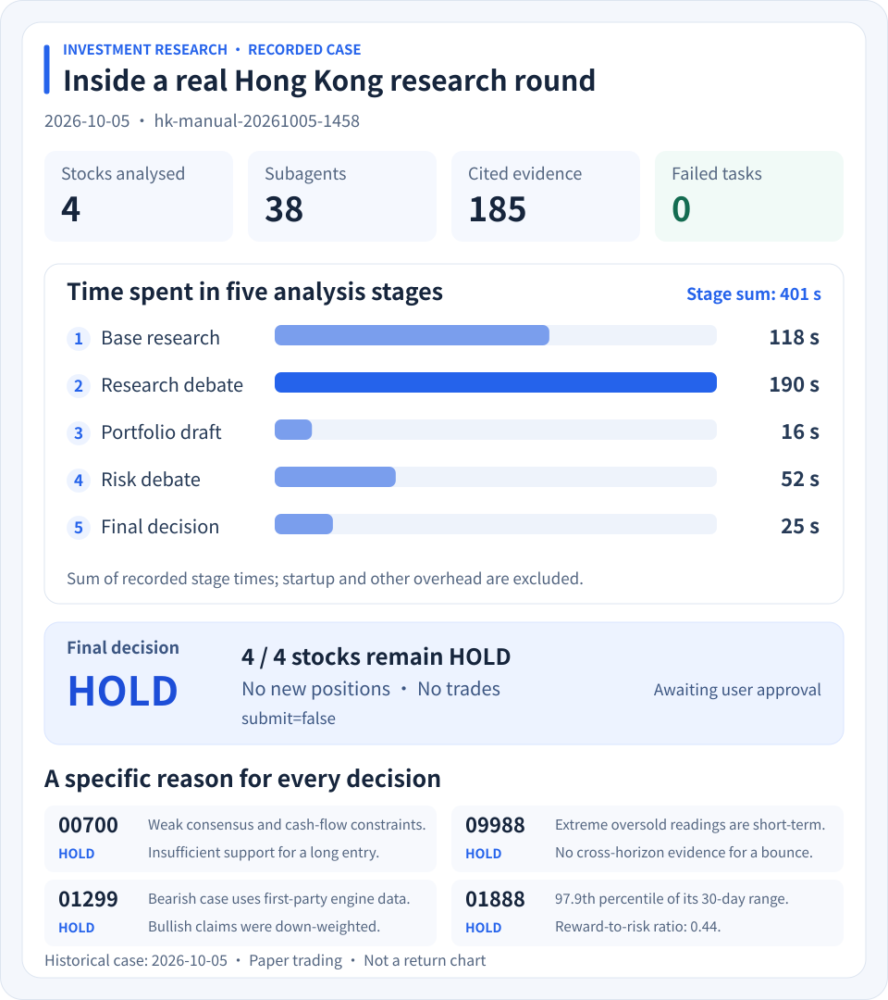
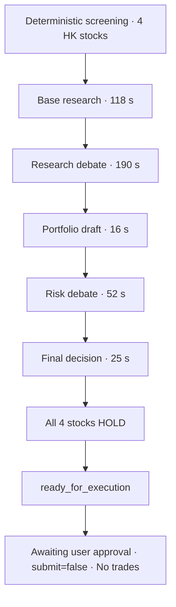

# AI-Driven Global Portfolio Optimization & Multi-Agent Trading Automation System

**ai-trading-automation**

[简体中文](README.md) | [English](README_EN.md)

[](https://github.com/Robertzsy/ai-trading-automation/releases/tag/v2.2.0)
[](LICENSE)
[]()

AI Trading Automation is a desktop application for investment research and **paper trading** across China A-shares, Hong Kong stocks, U.S. equities, and exchange-traded funds, with deterministic screening, a 13-role multi-agent analysis pipeline, and hard risk-controlled execution. Version 2.x is deeply rebuilt on DeepSeek Harness (DSH), but presents a standalone product: no workspace selector, runtime-mode selector, or platform branding—only the Dashboard, Investment Assistant, Analysis Centre, and Settings.

The current source and latest installer are both **2.2.0**, including naming unification, shared research data, and the holdings-linked Dashboard.

> This project supports research and paper trading only. It does not connect to a live broker and should not be used directly with real capital.

## Table of Contents

- [Features](#features)
- [Installation](#installation)
- [Run from Source](#run-from-source)
- [Core Investment Logic](#core-investment-logic)
- [Architecture](#architecture)
- [Version History](#version-history)
- [Safety Boundaries](#safety-boundaries)
- [Tests and Release Gate](#tests-and-release-gate)
- [Documentation](#documentation)
- [Branches and Compatibility](#branches-and-compatibility)
- [License](#license)

## Features

- **Four markets in one app**: unified market data, screening, analysis, and paper accounts for A-shares, Hong Kong stocks, U.S. equities, and ETFs; T+1/T+0, lot sizes, price limits, commission, stamp tax, and slippage rules are built in per market.
- **Deterministic screening**: hard filters plus a six-factor weighted score (momentum / trend / liquidity / valuation / volume / low volatility); every selected stock carries Chinese-language evidence, and weights and thresholds are configurable.
- **13-role committee-style analysis**: four base-research tracks → bull-bear debate → research manager and per-symbol trader → portfolio draft → three-way risk debate → final decision; conclusions must cite evidence, and live stages and checkpoints are visible.
- **Risk controls the AI cannot bypass**: three-tier strategy mandate, position capping, drawdown circuit breaker, and built-in stop-loss/take-profit; every AI decision must pass the deterministic Python risk layer and paper broker.
- **Productized desktop app**: Dashboard, Investment Assistant, Analysis Centre, and Settings; one-click install, single instance, tray icon, autostart, and in-place upgrades that preserve data.
- **Holdings-linked Dashboard**: account metrics and allocations remain in each market's native currency; select a holding to inspect its daily history, line/candlestick views, time ranges, cost basis, volume, MA20 and fill dates, with source and data dates shown.
- **Conversational AI assistant**: retains DSH-native reasoning, streaming, tools, Skills, plans, and subagents; IA can also inspect logs, edit source, and run tests to maintain itself.

## Installation

- Download `AiTradingAutomation-Setup-x64.exe` from the [v2.2.0 release](https://github.com/Robertzsy/ai-trading-automation/releases/tag/v2.2.0)
- Windows 10/11 x64. The installer bundles Python, Node.js, the .NET desktop runtime, and a WebView2 fallback installer.

Download the [SHA-256 file](https://github.com/Robertzsy/ai-trading-automation/releases/download/v2.2.0/AiTradingAutomation-Setup-x64.exe.sha256) alongside the installer. Compute the installer checksum in PowerShell and compare it with that file:

```powershell
Get-FileHash .\AiTradingAutomation-Setup-x64.exe -Algorithm SHA256
```

The program is installed under `%LocalAppData%\Programs\InvestmentAuto`, while user data lives under `%LocalAppData%\InvestmentAuto`. In-place upgrades preserve accounts, holdings, reports, configuration, credentials, and sessions. The 2.2.0 on-machine upgrade check preserved all 78,911 user-data files with zero missing, changed, or added files, all DPAPI secrets still decrypt, and the upgrade removes pre-rename executables, shortcuts, and autostart entries.

## Run from Source

Python 3.10+, Node.js 22+, and the .NET 8 SDK are required; .NET is needed only when building the desktop shell.

```powershell
# Install Python dependencies
python -m venv .venv
.\.venv\Scripts\python.exe -m pip install -e .

# Terminal 1: start the investment engine
.\.venv\Scripts\python.exe -m engine.main serve

# Terminal 2: start the AI Trading Automation web product shell
.\app\scripts\dev.ps1 -Port 4567
```

Open `http://127.0.0.1:4567`, then configure the model and API key in Settings.

## Core Investment Logic

AI Trading Automation's investment intelligence is built from three deterministic blocks: **exclude, score, and explain screening**, a **13-role committee-style analysis**, and **risk discipline the AI cannot bypass**.

- **Screening**: hard filters first (symbol normalization, minimum price / turnover / market cap, PE/PB caps, excluding ST/delisting/warrants), then a six-factor weighted ranking with Chinese-language evidence per pick;
- **Multi-role analysis**: five stages and 13 roles (technical/fundamental/news/sentiment → bull-bear debate → research manager and trader → portfolio draft → three-way risk debate → risk manager → portfolio manager); conclusions must cite evidence, and under-researched holdings are forced to HOLD;
- **Decision and risk control**: a three-tier strategy mandate defines hard boundaries; position = min(market per-stock cap, strategy per-stock cap); a drawdown circuit breaker force-liquidates; stop-loss/take-profit outrank AI suggestions; trading is limited to the allowed pool and prices are fetched live by the engine.

See [Investment Logic](docs/INVESTMENT_LOGIC_EN.md) for the full details: factor formulas, role responsibilities, risk parameters, and a business-value assessment.

### A real worked example

The complete record of one Hong Kong round on 2026-10-05 (cycle `hk-manual-20261005-1458`), with symbols taken from deterministic screening:

[](docs/assets/hk-case-study.en.svg)

Click the figure to enlarge it. Timings sum the recorded stages and exclude startup and other overhead; the figure shows the research process and decisions.

<details>
<summary>Expand the five-stage flow and original round record</summary>



| | Measured |
|---|---|
| Input | 4 Hong Kong stocks from screening: `01888`, `00700`, `09988`, `01299` |
| Process | 5 stages · 38 subagents · **0 failures** · 185 cited evidence items |
| Stage timings | base research 118s → research debate 190s → portfolio draft 16s → risk debate 52s → final decision 25s |
| Outcome | **all four HOLD**, no new positions opened |
| Terminal state | `ready_for_execution` (awaiting user approval; `submit=false`, so no trade was placed) |

</details>

<details>
<summary>Expand the evidence behind each stock decision</summary>

Each symbol came back with a specific, checkable reason rather than a vague "wait and see":

- **`00700`** — the research manager's weak consensus of 0.62 fell below the confidence a long entry requires; the bearish causal chain lined up in time (results release → next-day high-volume breakdown → broker downgrade); the bullish fundamentals lacked support (Q2 adjusted net profit +9% against revenue +11%, H1 capex +82% year on year); the only positive facts (buybacks, a broker target price) were qualified by free cash flow turning negative.
- **`09988`** — the research manager was bearish at 0.66, above the 0.55 entry threshold, but that threshold only gates long entries and a bearish call is not an entry reason; MA60 and MA250 sit far above the price, and the extreme oversold reading is short-horizon only (RSI6 18.92) while the medium horizon is neutral (RSI14 49.03), so a bounce has no cross-horizon evidence.
- **`01299`** — the bearish case rests on first-party engine data and is internally consistent (below every moving average, a 120-day closing low, expanding negative MACD, falling on volume); the bullish load-bearing claims rest on non-engine interfaces and derived values, so they were down-weighted.
- **`01888`** — the entry price sat at the 97.9th percentile of its 30-day range with unconfirmed volume (49.82M against a 62.37M volume MA10); the structural stop implied −12.4% for a reward-to-risk of only 0.44; the "8–10× forward PE" claim was a derived value and could not be verified.

</details>

> The round kept all four stocks HOLD when the evidence was insufficient. After 38 subagents and 185 evidence items, it opened no new positions and retained the approval-pending state. Evidence requirements and hard risk controls govern every trade submission.

## Architecture

```text
Windows WPF + WebView2
          │
AI Trading Automation product shell
          │
DSH conversation / tools / Skills / subagents / workflows
          │  token-protected loopback HTTP API
Python investment engine
          │
market data, screening, portfolio, risk, paper broker, audit, scheduler
```

- `app/`: DSH profiles, preset, Skills, investment tools bridge, fixed workflow, and product UI.
- `engine/`: investment facts, configuration, cycle state, hard risk controls, paper broker, and scheduler.
- `windows/desktop/`: WPF/WebView2 shell and process lifecycle.
- `installer/`: self-contained Windows installer.
- `tests/`: engine, recovery, idempotency, configuration, and desktop regressions.

## Version History

| Version | Core changes |
|---|---|
| 2.0.0 | Replaced the 1.x custom Agent/window split with DSH-native conversations, tools, Skills, subagents, and workflows. Investment business logic moved into an independent Python engine, with a Windows desktop release, DPAPI credentials, and 1.x data migration. |
| 2.1.0 | Turned “DSH plus an investment preset” into the standalone AI Trading Automation product. The UI gained a Dashboard, live Analysis Workflow, and Settings while removing workspace/mode selection and runtime branding. Native DSH conversation, reasoning, streaming, and tool rendering remained unchanged. |
| 2.1.1 | Separated stock screening from security analysis. User-specified symbols now enter the fixed full workflow directly. Added asynchronous cycles, status polling, and first-generation execution idempotency to eliminate ad-hoc window analysis, long-request timeouts, and duplicate starts. |
| 2.1.2 | Added durable broker receipts, decision fingerprints, cross-process leases, restart recovery, and strong binding between user-requested symbols and completed analysis. Internal headless and role sessions moved to an isolated DSH Home and no longer pollute the user session list. |
| 2.1.3 | Enabled IA filesystem, PowerShell, search, background-job, and Ralph self-maintenance capabilities. Added the self-maintenance Skill and fixed workflow-schema compatibility, failed-cycle retry races, Windows atomic writes, and accidental packaging of development data. |
| 2.1.4 | Rebuilt the interface on a design-token layer: a pinned light theme, full WCAG AA contrast, one icon set and four elevation levels, with the smallest type raised from 11px to 12px. Reworked the Analysis Centre (entries moved to the top, pre-flight collapsed, graphical progress, rounds can be stopped) and the Dashboard (four vertical market cards plus a holdings table, with trend colour following each market's convention). Merged the Analysis Workflow tab into the Analysis Centre. Fixed rounds failing at startup, workflow status that never advanced, and holdings columns offset from their data. |
| 2.1.5 | Linked holdings to individual stock history; added per-currency metrics, allocation, candlesticks, cost basis, volume and simulated fill dates; extended the version gate to npm lockfile metadata and updated browser acceptance; added case-study figures and expandable flows to the README. |

See the [Chinese changelog](CHANGELOG.md), [English changelog](CHANGELOG_EN.md), and [bilingual v2.1.5 release notes](docs/RELEASE_NOTES_2.1.5.md) for the complete record.

## Safety Boundaries

IA runs with the DSH `danger-full-access` preset. Within the current Windows user's authority, it can inspect logs, modify project source, run PowerShell, execute tests and builds. System permissions and trading authority remain separate:

- Paper accounts and the paper broker are mandatory.
- Manual submissions still require user approval.
- Every decision must pass the Python mandate and deterministic risk checks.
- Cycle IDs, decision fingerprints, and account-embedded execution receipts prevent duplicate fills.
- API keys and webhooks are stored through Windows DPAPI and never written to ordinary configuration or logs.
- Headless and role subagent sessions live in an isolated internal DSH Home and do not enter the user session list.

## Tests and Release Gate

The 2.1.5 source passed:

- 381 Python tests; six online market-data checks skipped.
- 38 Node plugin tests.
- 20 Windows desktop tests.
- Browser acceptance for navigation, market and holding selection, the Analysis Centre, settings and contrast; real holding history and 1280px / 360px layouts verified.
- Skills/plugin composition, three generated-source gates and all 17 version declarations; the preceding desktop upgrade preserved all 78,691 user-data files.

See the [repository audit](docs/REPOSITORY_AUDIT_2026-10-09.md) for GitHub, version and dependency findings.

Run the complete release gate with:

```powershell
powershell -ExecutionPolicy Bypass -File scripts\release-check.ps1
```

## Documentation

- [Investment Logic (EN)](docs/INVESTMENT_LOGIC_EN.md) · [投资逻辑详解](docs/INVESTMENT_LOGIC.md)
- [2.0 architecture](docs/ARCHITECTURE_2.0.md) · [Engine API](docs/ENGINE_API.md) · [Product shell](docs/PRODUCT_SHELL.md) · [App runtime guide](app/README.md)

## Branches and Compatibility

- `dsch/2.0`: current 2.x development and release branch, and the repository default.
- `legacy-1x` (tag): the final state of 1.x, kept as history and fallback. 2.0 was a
  complete rebuild, so the 1.x code is archive only and no longer maintained — it
  does not need a branch of its own.
- 1.x user data can be migrated to 2.x; migration and in-place upgrades never delete the source data.

## License

[MIT License](LICENSE)
