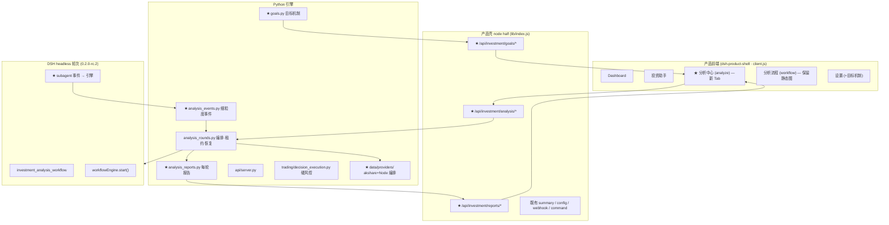
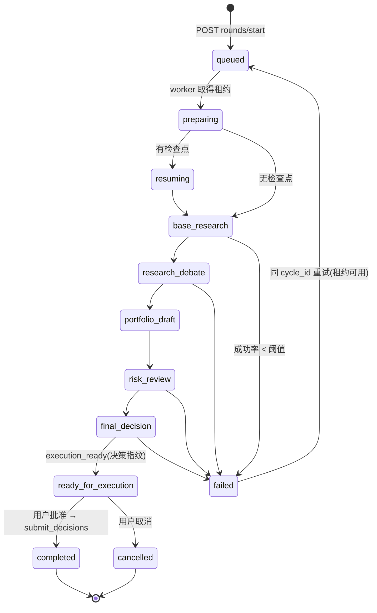

# 分析中心升级方案（手动分析 · 流程可视化 · 每轮报告 · 目标机制 · Subagent 并行）

> 状态：**已批准，执行中**
> 检查基线：`dsch/2.0` @ `988d5f0`（产品版本 2.1.3）
> 决策记录见 [§0](#0-已确认决策)。
>
> **注意**：`docs/UPGRADE_PLAN.md` 是 **1.x 时代的历史方案**（状态：已发布 0.5.0，引用当时尚存在的 `src/` 布局），
> 本文件是 **2.x 当前这一轮的升级方案**，两者是不同时期的独立文档，请勿混淆或互相覆盖。

---

## 0. 已确认决策

| # | 问题 | 决策 | 影响 |
|---|---|---|---|
| Q1 | 是否授权修 `release-check.ps1` 语法错 + `src`→`engine` | **是** | 见 P0-0；这是全部验收的前提 |
| Q2 | 是否把 `smoke-web.mjs` 接入发行门禁 | **是** | 见 P0-0 / P0-10 |
| Q3 | DSH 版本 | **升级到最新版 `0.2.0-rc.2`**（npm `latest`，与桌面壳实际运行版本一致） | 见 §7 |
| Q4 | 每轮报告完整性 | **方案 B**：全量 checkpoint 旁路落盘，报告正文仍为人类可读摘要 | 见 §4.4 |
| Q5 | 是否校正已退役模型名 | **是** | 见 P1-2b |
| Q6 | 是否落盘本方案 | **是**（本文件） | — |
| — | 新增：K 线接口失效 | **采用 akshare 作为通用稳定主源，保留现有 Node 源作兜底** | 见 §8 |

---

## 1. 项目现状检查结论

### 1.1 技术栈与形态

| 层 | 实际实现 | 关键文件 |
|---|---|---|
| 桌面壳 | WPF + WebView2, .NET 8 | `windows/desktop/` |
| 产品前端 | **DSH Client Plugin**（非独立工程，无 Vite/webpack） | `app/plugins/dsh-product-shell/lib/client.js` |
| 前端模块格式 | `window.__ModuleLoader__.load({id, factory})`；factory 内 `require("react")`；JSX 已预编译为 `react_jsx_runtime.jsx(...)` | 同上 :1-8 |
| 状态管理 | 自研 `defineStore`（`@deepseek-ai/dsh-client-runtime`）+ `useSyncExternalStore`；**无 Redux/Zustand** | 同上 :1312-1329 |
| 样式 | 手写 CSS 字符串 + DSH 主题 token（`--dsw-alias-*`）；**无 Tailwind/CSS-in-JS** | 同上 :14-70 |
| 后端 | Python 3.10+ 引擎 + 回环 HTTP API | `engine/api/server.py` |
| AI 编排 | DSH headless 会话 + `@deepseek-ai/dsh-workflow` | `engine/dsh_bridge.py` |
| 存储 | **纯文件**（JSON / MD / JSONL），无数据库 | `engine/paths.py` |

### 1.2 路由 / Tab 组织

非 URL 路由，是 shell store 的 `page` 字符串：

```js
// app/plugins/dsh-product-shell/lib/client.js:1105, 1312-1321
init: () => ({ page: "assistant", detailsOpen: false, contextOpen: true })
actions: { setPage: (draft, page) => { draft.page = page; } }
```

导航定义 `:1108-1113`（Dashboard / 投资助手 / 分析流程 / 设置），分发在 `:1144` 三元链。
**新增 Tab = `navigation` 加一项 + 三元链加一支**，无需路由库。

### 1.3 后端已具备、前端未接通的能力

| 能力 | 端点 | 位置 |
|---|---|---|
| 启动异步轮次 | `POST /api/analysis/rounds/start` | `engine/api/server.py:321-345` |
| 轮次状态 | `GET /api/analysis/run?cycle_id=` | `:253-262` |
| 轮次列表 | `GET /api/analysis/runs?market=&limit=` | `:242-252` |
| 最新轮次 | `GET /api/analysis/latest` | `:236-241` |
| 活动轮次 | `GET /api/analysis/rounds/active` | `:263-267` |
| 报告文件列表 | `GET /api/reports?market=&limit=` | `:195-213` |
| 最新报告元信息 | `GET /api/reports/latest` | `:214-219` |

轮次编排已成熟：幂等 `cycle_id`、跨进程文件租约（`runtime_lock.AtomicClaim`）、崩溃恢复扫描（`engine/analysis_rounds.py:192-329`）。

### 1.4 运行时事实

| 项 | 值 | 证据 |
|---|---|---|
| 产品版本 | 2.1.3 | `README.md:7`、`app/package.json:4` |
| DSH 锁定版本 | `0.1.0-rc.6` | `app/package.json:11` |
| DSH 桌面壳实际运行 | `0.2.0-rc.2`（node 24.21.0） | `D:\DeepSeek\dsh\dsh-runtimes\dsh-primary-runtime\runtime.json` |
| npm `latest` | `0.2.0-rc.2` | `npm view @deepseek-ai/dsh dist-tags` |
| `app/node_modules/@deepseek-ai/` | **空骨架**（195 目录 / 0 文件，`dsh/lib/bin.js` 不存在） | 目录枚举 |
| `app/node_modules` 填充方式 | **`npm install`**（`app/scripts/dev.ps1:21-26`）；`seed.ps1` 只把 `app/plugins/*` 复制到 `$DSH_HOME/profiles/*/node_modules/` | `app/scripts/seed.ps1:41-72` |

---

## 2. 问题定位与证据

### 2.1 前端无法手动开始分析

**定位：不是"坏了"，是"从未实现"。后端就绪，前端完全缺入口。**

1. `POST /api/analysis/rounds/start` 存在且可用。
2. 产品壳 node half 只代理 4 条路由（`summary` / `config` / `webhook` / `command`），**无 analysis 启动代理**：`app/plugins/dsh-product-shell/lib/index.js:101-211`。
3. `/api/investment/command` 转发到 `/api/commands/issue`（同上 `:195-198`），而命令枚举 `InvestmentCommand`（`engine/investment/contracts.py:11-25`）**没有任何"启动固定分析流程"的命令**。
4. 唯一入口是模型工具 `investment_analysis_workflow`（`app/plugins/dsh-investment-tools/lib/analysis-workflow.js:372-531`），必须由 AI 调用，且手动入口强制非空 `symbols`（`:396-398`）。
5. 前端全文 grep `analysis|rounds|start` 的 36 处命中中**无一处**调用 `/api/analysis/*`。

### 2.2 进度不可见

后端**已持久化**：`status` / `current_stage` / `started_agents` / `completed_agents` / `failed_agents` / `evidence_count` / `checkpoints` / `warnings` / `error`（`engine/analysis_runs.py:113-138`）。

**缺失**：

| 信息 | 状态 | 原因 |
|---|---|---|
| 阶段 | ⚠️ 只有单值 `current_stage` | 无阶段时间线 |
| **子任务身份** | ❌ | `agent_start` / `agent_end` 只做 `+= 1`（`engine/analysis_runs.py:176-183`） |
| 耗时 | ❌ | 只有 `completed_at` |
| 日志 | ❌ | headless stdout 仅在内存（`engine/dsh_bridge.py:34, 287`） |
| 错误历史 | ⚠️ | 单一 `error` 字符串 |

**关键澄清（已核实，勿误改）**：事件订阅 `analysis-workflow.js:362-369` **是正确的**。DSH 发射端为**双参数**：

```ts
workflow/agent-start → (info: WorkflowRunInfo, agent: WorkflowAgentInfo)
workflow/agent-end   → (info: WorkflowRunInfo, agent: WorkflowAgentEndInfo)
// WorkflowRunInfo      = { id, meta }
// WorkflowAgentInfo    = { seq, label, phase?, childId }
// WorkflowAgentEndInfo = WorkflowAgentInfo & { outcome: 'completed'|'failed'|'cancelled' }
```

`info.id` 与 `activeRuns` 的键 `String(run.id)`（`:345`）匹配；`:368` 的 `agent.outcome` 读的正是第二参数。
**所以问题不是"数据被丢弃"，而是 `label`/`phase`/`seq`/`childId` 一直就在第二个参数里、只是从未被读取。** 修复成本极低。

该契约在 `0.1.0-rc.6 → 0.2.0-rc.2` 间**字节级一致**。

**前端**：`WorkflowPage`（`client.js:400-501`）渲染**死图**——`workflowBands` 是硬编码字面量（`:370-377`），阶段名映射硬编码（`:378-389`），无子任务节点、无耗时、无日志。

### 2.3 每轮报告缺失 —— 「未生成 → 未存储 → 未查询 → 未展示」四层全断

`_write_report` 全仓库**仅 3 个调用点**：

| # | 调用点 | 触发路径 |
|---|---|---|
| 1 | `engine/scheduler.py:402` | 定时盘中轮次 |
| 2 | `engine/scheduler.py:459` | 定时收盘轮次 |
| 3 | `engine/trading/decision_execution.py:432` | `submit_decisions`（成交后） |

**分析轮次一路都不经过**：

```python
# engine/api/server.py:329-332
payload["submit"] = False
# engine/analysis_rounds.py:92-95
def _submit_allowed() -> bool:
    return False
```

→ 永不调用 `submit_decisions` → **永不写报告**。
→ 工作流在 `ready_for_execution` 即 `return`（`analysis-workflow.js:507-524`），**不发 `/api/analysis/runs/complete`**，故 `run["report"]` 从未写入（`engine/analysis_runs.py:217-219` 仅在 `finish()` 写）。

| 层 | 状态 | 证据 |
|---|---|---|
| ① 未生成 | 分析轮次无 MD 产出 | 3 个调用点均不可达 |
| ② 未存储 | `runtime/analysis_runs/` **0 文件**；`runtime/reports/` 89 文件全来自定时或 `submit_decisions` | 目录枚举 |
| ③ 未查询 | `/api/reports` 只返 `{file,mtime,size}`；`/api/reports/latest` 只返 `{file,generated_at}`，`read_text()[:1000]` 仅用于正则抽时间戳且**从不返回** | `server.py:207-211`、`status.py:63-70` |
| ④ 未展示 | 前端只渲染 `report.file`（`:187`、`:347`、`:540`）或 `reports.length`（`:296`、`:473`） | — |

**`compact()` 截断现实**：`analysis-workflow.js:205-210` 把字符串截到 1600 字符、数组 160 项、对象 80 键 → 阶段产物**不可完整恢复**。这是 Q4 选"方案 B（旁路全量落盘）"的原因。

**死代码可复用**：`engine/investment/reporting.py:6 format_cycle_result` 全仓库 **0 调用**，是现成的"轮次结果 → Markdown"渲染器，应复用而非新造。

### 2.4 目标机制完全不存在

`mandate.objective` 只是静态策略描述（`engine/investment/mandate.py:41,61,81`），不可编辑、无指标、无完成度。
引擎代码 `goal`/`objective` 的 17 处命中**全部**是"目标价/目标仓位/目标日期"词义。
DSH 自带 `ctx.goals` 仅会话级，与投资轮次无关。

### 2.5 DSH subagent：已启用一半，不可见，并行度未打满

**已启用**（`app/presets/investment/agent.cordis.yml:164-230`）：`tool-subagent`（spawn/continuable）、`tool-subagent-fork`（fork/one-shot）、`tool-subagent-control`、`workflow-worker-thread`、`investment-analysis-workflow`、`tool-workflow`、`tool-ralph`。

workflow 里**每个 `agent()` 就是一个 in-process DSH subagent session**，事件已在跑。

**并行度真实边界（已核实，勿调错旋钮）**：

| 机制 | 上限 | 证据 |
|---|---|---|
| workflow `agent()` 并发 | **FIFO 槽池**，默认 `Math.min(16, max(1, availableParallelism()-2))` | `dsh-workflow-worker-thread/lib/index.js:848,880`；`worker.cjs:383-397` |
| `parallel()` 自身 | **无上限**（`Promise.all`） | `worker.cjs:547-554` |
| `pipeline()` | **无跨阶段 barrier**，item 内阶段串行 | `worker.cjs:566-575` |
| `maxTotalAgents` | 默认 1000，per-run **只能降低不能提高** | `:849,881`；`worker.cjs:408`；`:834-835` |
| `maxParallelToolCalls` | 默认 10；管**同一条 assistant 消息内并发 `subagent` 工具调用** | `dsh-agent-loop/lib/index.js:896` |
| `dsh-llm` 全局并发限制 | **不存在** | grep 0 命中 |
| `@deepseek-ai/dsh-subagent maxActiveSubagents` | 默认 8；**只管 `subagent` 工具，不管 workflow** | Cordis Inspect |

**真正的瓶颈**：`analysis-workflow.js:490-500` 是 `pipeline(symbols, async (...))`，每标的内部串行 4 阶段（基础研究 → 辩论 → 研究经理 → 交易员），**30 标的 = 30 条串行链**。而引擎原生支持无 barrier 的全链路 pipeline。

**死配置**：`autonomous.agent_workflow.max_parallel_workers: 4`（`config/config.yaml:53`）**无任何代码读取**。

**为什么必须自建可视化**（两条 DSH 既有 UI 路径都不可用）：
1. `tool-workflow/*` 会话事件 + `dsh-client-ui-workflow-run`：只记录**顶层 `dsh-tool-workflow` 调用**，"direct `WorkflowEngine` consumers do not"。本项目走 `dsh-investment-workflow/lib/index.js:30` **直接消费 `ctx.workflowEngine`**，不产生这些事件；且 `ui-workflow-run` 已被禁用（`app/profiles/investment-web/cordis.patch.yml:108-109`）。
2. `useSessions(s => s.subagentsByParent)` 子代理树：客户端目录只跟踪 `subagent` **工具**登记的子会话，workflow `agent()` 的 in-process 子会话**未必**进入。

### 2.6 构建/发布链路存在阻断级缺陷

| 缺陷 | 证据 |
|---|---|
| **`scripts/release-check.ps1:60-62` PowerShell 语法错误**（`throw "... }` 后缺一个 `}`）→ 被 README:134 引为"完整发行门禁"的脚本**无法解析执行** | 逐行读取 |
| **`src/` 不存在但 3 处仍引用** | `pyproject.toml:22`、`scripts/build-windows-release.ps1:51`（且打包 `src` 而非 `engine`）、`.github/workflows/tests.yml:30` |
| Node 版本三处不一致 | `fetch-runtime.ps1:3`(v22.19.0) vs `build-windows-release.ps1:17`(v20.18.1) vs `release-check.ps1:77-78`(扁平路径) |
| 版本号手工散落 11 处且已漂移 | `dsh-investment-tools`=2.0.0-p2、`dsh-investment-ui`=2.0.0-p5 |
| 无任何自动化测试覆盖 `dsh-product-shell/lib/client.js` | 无 `test/` 目录；`check-plugins.mjs:66-71` 仅 `node --check` 语法；`smoke-web.mjs` **未接入门禁** |
| CI 从不跑 Node/dotnet/skills/plugins 检查 | `.github/workflows/tests.yml` |

### 2.7 主题 token 拼写错误（既有 UI bug）

产品壳引用 `--dsw-alias-state-warning-primary`（`client.js:44,63,65`），该 token **在 rc.6 与 rc.2 中都不存在**；正确名是 `--dsw-alias-state-warn-primary`。
受影响：`PageHeader` 警示圆点、流程图 `guard` 节点、`.ia-flow-warning` 横幅。
`dsh-investment-ui` 因写了 fallback（`var(..., #d97706)`）而未受影响 —— 反证正确做法。

运行版主题实际注入的 token 只有 14 个（Cordis Inspect）：`bg-base` / `bg-layer-1` / `bg-layer-2` / `bg-overlay` / `border-l1` / `border-l2` / `brand-primary` / `label-primary` / `label-secondary` / `state-error-primary` / `state-idle-primary` / `state-success-primary` / `state-warn-primary` / `specific-sidebar-fill`。
产品壳还引用了 `bg-module-platform`、`label-tertiary`、`interactive-bg-hover(-solid)`、`button-primary-fill(-hover)` —— **均不在目录中**，必须写 fallback。

### 2.8 K 线接口

**实测：4 个市场当前全部正常**，无法复现用户报告的失效：

| 标的 | 市场 | count | 来源 |
|---|---|---|---|
| `sh600519` | cn | 640 | 腾讯 qfq 前复权 |
| `00700` | hk | 1024 | 腾讯 qfq |
| `AAPL` | us | 1023 | 腾讯 qfq |
| `510300` | etf | 640 | 腾讯 qfq |

两个上游端点（`web.ifzq.gtimg.cn`、`money.finance.sina.com.cn`）均 HTTP 200。

**真实弱点（这才是要修的）**：

1. 兜底**仅对 cn 生效**：`scripts/stock-fetcher.js:867-875`、`:904-919`，hk/us/etf 主源失败即报错返回。
2. 兜底**语义不一致**：腾讯返回 **qfq 前复权**，新浪返回**不复权** → 降级后 `computeAllIndicators`（均线/MACD/动量/波动率）与回测**静默错算**。
3. 无重试、无来源标记，调用方无法判断数据来源与是否降级。

---

## 3. 升级目标拆解

| ID | 目标 | 现状 | 差距 |
|---|---|---|---|
| G1 | 手动点击开始分析 | 仅 AI 工具入口 | node 代理路由 + 前端表单 + 禁用/防重 + 状态同步 |
| G2 | 流程可视化 | 死图 + 3 个计数 | 持久化契约 + 前端组件 + 日志/耗时 |
| G3 | 每轮独立报告 | 分析轮次不生成 | 4 层全断 |
| G4 | 独立 Tab 集成 G1–G3 | 无 | 新 `analyze` Tab |
| G5 | 目标机制 | 完全不存在 | 数据模型 + 每轮评估 + 停止条件 |
| G6 | subagent 并行提速 | 已用一半、不可见 | 细粒度事件 + 全链路 pipeline |
| G7 | K 线多源加固 | 兜底覆盖不足 + 降权静默 | akshare 主源 + 来源可见 |
| G8 | 构建链路可用 | `release-check` 语法错 | P0-0 |

---

## 4. 落地方案

### 4.1 总体架构



### 4.2 前端 UI 与组件设计

#### 4.2.1 Tab 路由改动（3 处）

```js
// ① :1108-1113 navigation 插入
const navigation = [
  ["dashboard", "▦", "Dashboard"],
  ["assistant", "◎", "投资助手"],
  ["analyze",   "◈", "分析中心"],   // ← 新增
  ["workflow",  "⌁", "分析流程"],
  ["settings",  "⚙", "设置"]
];
// ② :1144 分发链插入一支
// ③ store init 保持 "assistant"
```

#### 4.2.2 组件树

```
AnalysisCenter(props)                         ← 容器：3 段式
├─ PageHeader title="分析中心" status={live} statusKind={kind}
├─ .ia-an-grid  grid-template-columns: 360px minmax(0,1fr)
│  ├─ 【左】StartPanel                        ← G1
│  │   ├─ MarketPicker (cn/hk/us/etf)
│  │   ├─ LabelInput   (默认 "manual"，[A-Za-z0-9_.-])
│  │   ├─ SymbolSourceTabs (手动输入 | 来自选股)
│  │   ├─ GoalPicker                       ← G5
│  │   ├─ PreflightList                    ← 预检清单
│  │   ├─ StartButton  data-kind="primary"
│  │   └─ ActionBar [停止][重试][刷新]
│  ├─ 【中】PipelineView                      ← G2
│  │   ├─ StageTimeline  (阶段 + 状态 + 耗时)
│  │   ├─ AgentBoard     (子任务卡片：label/phase/状态/耗时)
│  │   └─ LogPanel       (分级日志，可折叠)
│  └─ 【右】RoundReportPanel                  ← G3
│      ├─ RoundList    (倒序：日期/市场/label/状态/耗时)
│      ├─ ReportToolbar [(轮次A) (轮次B) 对比 导出]
│      └─ ReportBody    (MD 渲染，降级 <pre>)
```

#### 4.2.3 开始分析的交互契约

| 项 | 规则 |
|---|---|
| 按钮位置 | `StartPanel` 底部，`data-kind="primary"` |
| **禁用条件**（全部满足才可点） | ① `symbols.length > 0`（镜像 `server.py:335-338` 与 `analysis-workflow.js:396-398`）② `symbols.length <= 40`（`MAX_SYMBOLS`，`analysis_rounds.py:54`）③ `!control.kill_switch` ④ 无 `status=="running"` 轮次 ⑤ 引擎可达 |
| 状态（6 态） | `idle → submitting → queued → running → ready_for_execution / failed / cancelled`，直接映射引擎 `status`，不新造词 |
| **防重复提交** | ① `submitting` 期间 `disabled`；② 客户端生成 `cycle_id` 存 `sessionStorage`，**重试沿用同 id，新点击才生成新 id**；③ 服务端幂等已存在（同 `cycle_id` 永不启动第二轮，`analysis_rounds.py:222-266`） |
| 停止 | `POST /api/investment/analysis/stop` → 新增 `analysis_rounds.cancel(cycle_id)`。**只影响分析，绝不影响账户** |
| 重试 | 同 `cycle_id` 再 POST；引擎走 failed→running 并从检查点续跑（`analysis_rounds.py:227-261`） |
| 轮询 | `/api/investment/analysis/run?cycle_id=`，idle 8s / running 2s，`document.hidden` 时暂停 |

#### 4.2.4 主题兼容层（必须做）

```css
.ia-shell{
  --ia-surface:     var(--dsw-alias-bg-module-platform, var(--dsw-alias-bg-layer-1, transparent));
  --ia-label-3:     var(--dsw-alias-label-tertiary, var(--dsw-alias-label-secondary, inherit));
  --ia-hover:       var(--dsw-alias-interactive-bg-hover, color-mix(in srgb, var(--dsw-alias-brand-primary) 10%, transparent));
  --ia-hover-solid: var(--dsw-alias-interactive-bg-hover-solid, var(--ia-hover));
  --ia-warn:        var(--dsw-alias-state-warn-primary, #d97706);      /* 修正拼写 */
  --ia-danger:      var(--dsw-alias-state-error-primary, #ef4444);
  --ia-ok:          var(--dsw-alias-state-success-primary, #22c55e);
  --ia-idle:        var(--dsw-alias-state-idle-primary, var(--dsw-alias-border-l2, #94a3b8));
  --ia-brand:       var(--dsw-alias-brand-primary, #2f6fed);
}
```

新组件**一律用 `--ia-*`**，不得直接引用不在目录中的 token。

### 4.3 分析流程状态机



**术语消歧（前端必须落实）**：

| 概念 | 实体 | 文案 |
|---|---|---|
| 阶段 | `current_stage` ∈ {preparing, resuming, base_research, research_debate, portfolio_draft, risk_review, final_decision, execution, ready_for_execution, completed, failed} | 「阶段」 |
| 轮次 | `cycle_id` | 「分析轮次」 |
| 辩论轮次 | `research_debate_rounds` / `risk_debate_rounds` | 「辩论轮次 R1/R2」 |
| 子任务 | 一次 `agent()` = 一个 subagent session | 「子任务」 |

#### 4.3.1 运行记录数据模型（`engine/analysis_runs.py`，`version: 1 → 2`，纯增量）

```jsonc
{
  "version": 2,
  "cycle_id": "20260901-cn-manual-3f2a1b9",
  "market": "cn", "label": "manual",
  "status": "running", "current_stage": "research_debate",
  "symbols": ["600519","000858"], "symbols_source": "user",
  "goal_id": "goal-20260901-01",              // ★ 新增
  "expected_agents": 21, "started_agents": 14,
  "completed_agents": 11, "failed_agents": 1, "evidence_count": 47,

  "stages": {                                  // ★ 阶段时间线
    "base_research": {
      "status": "completed",
      "started_at": "...", "finished_at": "...", "duration_ms": 796000,
      "agents_total": 8, "agents_done": 8, "agents_failed": 0,
      "result_digest": { "symbols_ok": 2, "symbols_failed": 0, "evidence": 32 }
    },
    "research_debate": { "status": "running", "started_at": "...",
      "finished_at": null, "duration_ms": null,
      "agents_total": 8, "agents_done": 5, "agents_failed": 1 }
  },

  "agents": {                                  // ★ 子任务/subagent 明细
    "base_research:600519:technical_analyst": {
      "seq": 3, "label": "600519:technical_analyst",
      "phase": "基础研究", "stage": "base_research",
      "child_id": "sess-...",
      "status": "completed",                   // running|completed|failed|cancelled
      "started_at": "...", "finished_at": "...", "duration_ms": 61234,
      "summary": "趋势向上，量能配合，关键位 1680", "error": null
    }
  },

  "checkpoints": { /* 保持 v1 语义不变 */ },
  "logs": [ /* 环形缓冲，上限 400 条：{at, level, stage, agent, message} */ ],
  "warnings": [], "error": null,
  "started_at": "...", "updated_at": "...", "completed_at": null,

  "report": {                                  // ★ Q4 方案 B
    "cycle_report":  "runtime/analysis_runs/reports/{TS}-{market}-{label}-{cycle_id}-cycle.md",
    "round_report":  "runtime/reports/{YYYYMMDD}-{market}-{label}-{cycle_id}.md",
    "archive_dir":   "runtime/analysis_runs/archive/{cycle_id}/",   // 全量 checkpoint（未截断）
    "generated_at": "...", "bytes": 18422
  }
}
```

**读侧兼容**：`version` 缺失即视为 v1，缺失字段用默认值补齐；`/api/analysis/*` 既有返回结构不变（只增字段）。

#### 4.3.2 进度百分比（加权，避免"agent 计数"误导）

```
weights = {preparing:0.05, base_research:0.35, research_debate:0.30,
           portfolio_draft:0.10, risk_review:0.15, final_decision:0.05}
阶段完成率 = (agents_done + 0.5 × agents_running) / max(1, agents_total)
progress  = Σ(权重 × 阶段完成率)
```

### 4.4 每轮报告

#### 4.4.1 生成（补第①层）

新增 `engine/analysis_reports.py`，在轮次进入终态（`execution_ready` 与 `failed`）时生成：

| 产物 | 路径 | 内容 |
|---|---|---|
| **轮次报告（主）** | `runtime/reports/{YYYYMMDD}-{market}-{label}-{cycle_id}.md` | 人类可读单轮报告 |
| **运行档案** | `runtime/analysis_runs/reports/{TS}-...-cycle.md` | 结构化完整档案 |
| **全量旁路**（Q4-B） | `runtime/analysis_runs/archive/{cycle_id}/{stage}.json` | **未截断**的阶段结果，绕开 `compact()` 的 1600 字符截断 |
| 索引 | `runtime/reports/index.json` | `[{cycle_id, market, label, status, started_at, finished_at, duration_ms, report_file, report_bytes, decisions_count, evidence_count, goal_id, goal_score}]` |

轮次报告正文（复用 `engine/investment/reporting.py:format_cycle_result`，**不新造渲染器**）：

```markdown
# CN manual 分析轮次报告 · 20260901-cn-manual-3f2a1b9

> 生成时间：... | 模式：手动分析
> 阶段：6/6 完成 | 耗时：8分42秒 | 子任务：21 完成 / 0 失败 | 证据：47 条

## 一、本轮目标与完成度        ← G5
## 二、阶段时间线              ← G2
## 三、子任务明细              ← G2（含未截断产物的引用路径）
## 四、研究结论（逐标的）
## 五、风险与降级
## 六、本报告未执行交易
本轮为分析轮次（submit=false）。如需执行，请显式批准后用同一 cycle_id 提交；
引擎将校验决策指纹。
## 附：日志尾部（最近 50 条）
```

**容错**：报告生成失败**不得**让轮次失败（照抄 `decision_execution.py:434-435` 姿态）。

#### 4.4.2 查询（补第③层）

| 层 | 方法 | 路径 | 说明 |
|---|---|---|---|
| 引擎 | GET | `/api/reports/index?market=&limit=&status=` | `index.json` 切片 |
| 引擎 | GET | `/api/reports/content?cycle_id=` 或 `?file=` | **返回正文**。安全：`file` 必须匹配 `^[A-Za-z0-9_.-]+\.md$` 且 `resolve()` 后仍在 `REPORT_DIR` 内（防穿越） |
| 引擎 | GET | `/api/reports/diff?a=&b=` | 两轮对比，输出决策表字段级差异 |
| 壳 | POST | `/api/investment/analysis/start` | → `rounds/start` |
| 壳 | GET | `/api/investment/analysis/run?cycle_id=` | → `/api/analysis/run` |
| 壳 | GET | `/api/investment/analysis/runs?limit=` | → `/api/analysis/runs` |
| 壳 | POST | `/api/investment/analysis/stop` | → `analysis_rounds.cancel` |
| 壳 | GET | `/api/investment/reports/index` | → `/api/reports/index` |
| 壳 | GET | `/api/investment/reports/content?cycle_id=` | → `/api/reports/content` |

**必须走壳代理**：产品壳是唯一能把引擎回环 token 挡在浏览器外的地方（`lib/index.js:11-12`）。

#### 4.4.3 展示与导出

- MD 渲染；不可用时 `<pre style="white-space:pre-wrap">` 降级（**零依赖是硬约束**）。
- 导出：前端 `Blob` + `URL.createObjectURL`，**不新增后端导出端点**。
- 对比：选两轮 → `GET reports/diff` → 决策表并排。
- 仪表盘只保留汇总与趋势，不替代单轮报告。

### 4.5 目标机制（G5）

#### 4.5.1 数据模型 `engine/goals.py`

存储：`runtime/investment/goals/{goal_id}.json` + `active.json`

```jsonc
{
  "version": 1, "goal_id": "goal-20260901-01",
  "title": "A 股组合 3 个月稳健增值",
  "status": "active",                 // active|achieved|abandoned|blocked
  "priority": 1, "created_by": "user",
  "horizon": { "kind": "deadline", "until": "2026-12-01" },
  "sub_goals": [
    { "id": "G1", "title": "控制组合最大回撤", "priority": 1, "weight": 0.4,
      "metric": { "name": "max_drawdown_pct", "op": ">=", "target": -8, "unit": "%" },
      "completion_criteria": "任一轮次评估中 max_drawdown_pct >= -8%" },
    { "id": "G2", "title": "研究覆盖度", "priority": 2, "weight": 0.3,
      "metric": { "name": "base_research_success_ratio", "op": ">=", "target": 0.9, "unit": "ratio" },
      "completion_criteria": "基础研究成功率 >= 0.9" },
    { "id": "G3", "title": "决策置信度", "priority": 3, "weight": 0.3,
      "metric": { "name": "mean_decision_confidence", "op": ">=", "target": 0.7, "unit": "ratio" },
      "completion_criteria": "平均决策置信度 >= 0.7" }
  ],
  "evaluation": { "cadence": "per_cycle", "min_cycles_before_stop": 2 },
  "stop_conditions": {
    "achieve_when": { "weighted_score": ">= 0.85", "consecutive_cycles": 2 },
    "abandon_when": { "deadline_passed": true,
      "or": [{ "weighted_score": "<= 0.35", "consecutive_cycles": 3 }] }
  },
  "continue_conditions": {
    "iterate_when": { "weighted_score": "< 0.85", "cycles_remaining": "> 0",
      "and": [{ "kill_switch": false }] }
  },
  "fallback": {
    "on_metric_unavailable": "skip_and_report",
    "on_regression": "raise_priority_and_narrow_scope",
    "on_repeated_failure": { "after_cycles": 3, "action": "block_and_ask_user" }
  },
  "history": [
    { "cycle_id": "...", "evaluated_at": "...", "weighted_score": 0.72,
      "per_sub_goal": { "G1": {"actual": -0.024, "met": true, "score": 1.0},
                        "G2": {"actual": 1.0, "met": true, "score": 1.0},
                        "G3": {"actual": 0.61, "met": false, "score": 0.0} },
      "deviation": ["G3 低于阈值 0.09"],
      "next_focus": ["提升证据引用密度"],
      "stop_decision": "continue" }
  ]
}
```

**指标来源（全部来自已持久化事实）**：`max_drawdown_pct`（`engine/investment/status.py` / `portfolio/account.py`）、`base_research_success_ratio`（工作流回传，`analysis-workflow.js:491-494` 写入 checkpoint）、`mean_decision_confidence`（`run.decisions`）、`stage_duration_ms`（新增 `stages`）。

**指标不可得时**：`skip_and_report` —— 报告写"指标不可得，已跳过"，**不得**用 0 或猜测值代替。

#### 4.5.2 评估触发

轮次进入终态时由 `analysis_rounds._worker` 调用 `goals.evaluate_cycle(cycle_id)`，**幂等**（同 `cycle_id` 只写一条 history）。

#### 4.5.3 目标如何影响分析

1. **注入 task 提示词**（`engine/dsh_bridge.py:80-121`）：写入总目标、各子目标当前值与达成状态、上一轮失败焦点，并要求"不得为提高置信度而抬高仓位"。
2. **注入最终决策阶段**：`FINAL_SCRIPT` 的 `args` 增加 `goal`。
3. **停止条件是建议、不是自动停机**：真正停止自动轮次只由用户或 kill switch 触发（**安全边界**）。
4. **失败回退**：`repeated_failure` 时目标置 `blocked` 并请用户确认。

#### 4.5.4 接口

| 层 | 方法 | 路径 |
|---|---|---|
| 引擎 | GET | `/api/goals` / `/api/goals/active` / `/api/goals/{goal_id}` / `/api/goals/{goal_id}/history` |
| 引擎 | POST | `/api/goals/create` / `/update` / `/activate` / `/close` |
| 壳 | GET/POST | `/api/investment/goals*` |

目标**不接入** `config_api._PATH_VALIDATORS` —— 它是独立实体，不走 `config.yaml`。

### 4.6 DSH subagent 调度与并行

#### 4.6.1 先厘清两套机制

| 机制 | 是什么 | 本项目角色 |
|---|---|---|
| **workflow `agent()`** | `workflowEngine.start()` 内部的 in-process subagent session（provider `spawn`） | **固定分析流程已在用**。确定性编排，带来 schema 校验、`pipeline`/`parallel` 控制、可恢复检查点 |
| **模型工具 `subagent` / `subagent_fork`** | 模型自主委派 | 适合**不确定的探索型**任务 |

**结论**：固定多角色分析**继续用 workflow `agent()`**，**不要**改成模型调 `subagent`（会丢失 schema 契约与确定性，与 `agent.cordis.yml:58-65` 的铁律冲突）。

#### 4.6.2 提速一：跨标的串行 → 全链路 per-symbol pipeline（**最大收益**）

现状 `analysis-workflow.js:490-500`：`pipeline(symbols, ...)` 但**每标的内部串行 4 阶段**，30 标的 = 30 条串行链。

改为标的内并行化（4 角色已并行），并显式声明阶段拓扑：

```js
const rows = await pipeline(args.symbols, async (_prev, symbol) => {
  // ① 4 角色并行
  const analyses = (await parallel(args.roles.map((role) => () =>
    agent(..., { label: symbol + ":" + role, phase: "基础研究", schema: baseSchema })))).filter(Boolean);
  // ② 校验；不达标 → 短路为 HOLD 候选，不再跑后续
  if (analyses.length < args.minimum_analysts) return { symbol, failed: true, analyses };
  // ③ 多空辩论 × R 轮（双人并行）
  // ④ 研究经理 → ⑤ 交易员（有依赖，标的内部串行）
  ...
});
```

**预期**（30 标的 / 4 角色 / R=1，槽池 16）：

| 版本 | 时间模型 | 相对 |
|---|---|---|
| 现状 | `≈ 30 × T` | 1.00× |
| per-symbol pipeline | `ceil(30×6/16) × T ≈ 12 × T` | **≈2.5×** |

> **这是估算，不是实测。** P1-9 的 A/B 基准是唯一裁判；**没有基准数字不合并**。

#### 4.6.3 提速二：并发配置显式化（**不要调错旋钮**）

- **删除死键** `autonomous.agent_workflow.max_parallel_workers`（`config/config.yaml:53`，无代码读取）。
- **不要**调 `@deepseek-ai/dsh-subagent` 的 `maxActiveSubagents` —— 它只管 `subagent` 工具，**不管 workflow**。
- 真正相关的是 workflow 槽池（默认 `min(16, cores-2)`）与 `maxTotalAgents`（默认 1000）。当前每阶段上限（`:490-500`）分别为 120/120/1/4/1，**并非瓶颈**。
- 若需显式控制，在 `agent.cordis.yml` 的 delegation group 内配置 workflow 引擎，并向 `config.yaml` 增加**真正被读取**的键（并加入 `_PATH_VALIDATORS`）。
- ⚠️ 并发提升前必须实测 LLM 429 率。**默认值保持不动**。

#### 4.6.4 提速三 + 可见性：细粒度 subagent 事件

`analysis-workflow.js:362-369` 改为读取**已存在但未被使用**的第二参数：

```js
ctx.on("workflow/agent-start", (info, agent) => {
  const active = activeRuns.get(String(info.id));
  if (!active) return;
  void client.post("/api/analysis/runs/events", {
    cycle_id: active.cycleId, stage: active.stage, event: "agent_start",
    seq: agent?.seq, label: agent?.label, phase: agent?.phase, child_id: agent?.childId,
  }).catch(() => {});
});
ctx.on("workflow/agent-end", (info, agent) => {
  const active = activeRuns.get(String(info.id));
  if (!active) return;
  void client.post("/api/analysis/runs/events", {
    cycle_id: active.cycleId, stage: active.stage, event: "agent_end",
    seq: agent?.seq, label: agent?.label, phase: agent?.phase, child_id: agent?.childId,
    outcome: agent?.outcome,
  }).catch(() => {});
});
```

新端点 `POST /api/analysis/runs/events` → `engine/analysis_events.apply_event()`。
**独立于 `runs/update`**（后者语义是 checkpoint 且对终态早退，`analysis_runs.py:151-152`）。

**顺带收益**：`agent_end` 的 `outcome` 首次让主流程能感知单角色失败并**局部重试**（上限 1 次），替代当前整阶段 `throw`。

#### 4.6.5 失败处理

| 场景 | 现状 | 目标 |
|---|---|---|
| 单角色失败 | 计数 +1，静默 | 记录 `agents[label].error`；**局部重试 1 次**；仍失败 → 标的标记 `degraded` |
| 标的角色数不足 | 整体 `throw` | 保留 `validBaseResearch` 过滤（`:295-307`）；达阈值则**降级继续 + 写 warnings**；低于 `minimum_symbol_research_success_ratio` 才 `throw` |
| 阶段失败 | `throw` + `runs/fail` | 先落 `stage_end{status:failed}` 与日志尾部，再 fail |
| 全局取消 | 无 | `stop` → abort signal → `agent-end` 合成 `cancelled` |

### 4.7 后端接口 / 存储 / 任务队列改动汇总

| # | 文件 | 改动 | 风险 |
|---|---|---|---|
| 1 | `engine/analysis_runs.py` | v1→v2 记录形状；`cancel()`；`events()` 入口；读侧 v1 兼容 | 中 |
| 2 | **新** `engine/analysis_events.py` | 事件折叠纯函数（无 IO，便于单测） | 低 |
| 3 | **新** `engine/analysis_reports.py` | 每轮 MD + 档案 + 全量旁路 + `index.json`；复用 `reporting.format_cycle_result` | 低 |
| 4 | **新** `engine/goals.py` | 目标 CRUD + `evaluate_cycle()` | 中 |
| 5 | `engine/analysis_rounds.py` | worker 末尾调 `goals.evaluate_cycle` + `analysis_reports.generate`；`cancel()` | 中 |
| 6 | `engine/api/server.py` | 新端点（events / stop / reports index·content·diff / goals*）+ **路径穿越校验** | 中：安全面 |
| 7 | `engine/config.py` + `config_api.py` | 新增有效配置键白名单；删死键 | 低 |
| 8 | `app/plugins/dsh-product-shell/lib/index.js` | analysis / reports / goals 代理 | 低 |
| 9 | `app/plugins/dsh-investment-tools/lib/analysis-workflow.js` | 全链路 pipeline；细粒度事件；局部重试；目标注入 | **高**：核心流程 |
| 10 | `app/plugins/dsh-product-shell/lib/client.js` | 新 Tab + 3 组件 + token 兼容层 + 修 `warning` 拼写 | 中 |
| 11 | `engine/dsh_bridge.py` | `_analysis_task()` 注入目标；stdout 落 `runtime/logs/analysis/{cycle_id}.log` | 低 |
| 12 | `app/presets/investment/agent.cordis.yml` | `dsh-workflow-worker-thread` → **`dsh-workflow-ptc`**（见 §7） | 中 |
| 13 | **新** `engine/data/providers/*` | akshare 主源 + Node 兜底编排（见 §8） | 中 |

**存储布局（全部落在 `runtime/`）**：

```
runtime/
├── analysis_runs/
│   ├── {cycle_id}.json                       # v2 运行记录
│   ├── {cycle_id}.lease                      # 既有跨进程租约
│   ├── reports/{TS}-{market}-{label}-{cycle_id}-cycle.md
│   └── archive/{cycle_id}/{stage}.json       # ★ Q4-B 全量旁路（未截断）
├── reports/
│   ├── {YYYYMMDD}-{market}-{label}.md         # 既有：定时/成交
│   ├── {YYYYMMDD}-{market}-{label}-{cycle_id}.md   # ★ 新增：分析轮次
│   └── index.json                             # ★ 新增
├── investment/goals/{active.json, {goal_id}.json, {goal_id}.history.jsonl}
└── logs/analysis/{cycle_id}.log               # ★ headless stdout/stderr
```

**任务队列：不改。** `analysis_rounds` 的线程 + 文件租约模型已验证可跨进程；引入新队列收益低、风险高。

---

## 5. 分阶段实施计划

### P0-0 前置修复（阻断项，已完成授权）

| 项 | 内容 |
|---|---|
| P0-0a | 修 `scripts/release-check.ps1:60` 缺失的 `}` |
| P0-0b | `src`→`engine`：`pyproject.toml:22`、`build-windows-release.ps1:51`、`tests.yml:30` |
| P0-0c | Node 版本统一为单一事实来源 |
| P0-0d | `smoke-web.mjs` 接入门禁（带 `-SkipWeb` 开关） |
| P0-0e | 新增 `scripts/bump-version.ps1`（幂等 + `-Check`）；修 2 个插件版本漂移 |
| P0-0f | CI 补齐 Node / dotnet / check-* 步骤 |
| P0-0g | `cd app && npm install`（当前 `node_modules` 为空骨架；未装则无法运行/验证 UI） |

### P0 核心（G1+G2+G3+G4）

P0-1 … P0-9 见 §6 验收表；P0-10 为前端 UI 自动化验收。

### P1

| 序 | 任务 |
|---|---|
| P1-1 | `engine/goals.py` CRUD + `evaluate_cycle()` |
| P1-2 | 目标注入 `_analysis_task()` 与 `FINAL_SCRIPT` |
| P1-2b | **校正 config 中已退役模型名**（必须先于基准测试） |
| P1-3 | 目标 UI（`GoalPicker` + 设置页「目标」分区） |
| P1-4 | 报告「目标与完成度」章节 |
| P1-5 | 全链路 per-symbol pipeline 重构 |
| P1-6 | 单角色局部重试 + 降级继续 |
| P1-7 | 并发配置显式化 + 删死键 |
| P1-8 | 轮次对比（`/api/reports/diff` + UI 双选） |
| P1-9 | 目标评估测试 + **并行 A/B 基准** |
| P1-10 | CI 补齐（若 P0-0f 未覆盖） |

### P2

SSE 替代轮询 · 报告 PDF/HTML 导出 · 日志分级过滤与搜索 · 目标模板库 · `subagentsByParent` 实时子代理树 · 仪表盘目标趋势图 · **DSH 升级漂移告警** · `investment-auto.log` 轮转（`RotatingFileHandler`）

---

## 6. 验收标准

### P0-0

| # | 验收项 | 判定 |
|---|---|---|
| A0-1 | `release-check.ps1` **可解析并执行** | 跑到 manifest 阶段；输出各 gate PASS/FAIL |
| A0-2 | `pytest tests -q` | 退 0；**真实计数**以实跑为准 |
| A0-3 | `node --test app/plugins/*/test/*.test.mjs` | 退 0（22 项） |
| A0-4 | `node app/scripts/smoke-web.mjs <url>` | 全绿，且已入门禁 |
| A0-5 | `src` 幽灵引用清零 | `git grep -n "src\.main\|compileall.*src"` 无命中 |
| A0-6 | `app/node_modules/@deepseek-ai/dsh/lib/bin.js` 存在 | `Test-Path` → True |

### P0

| # | 验收项 | 判定 |
|---|---|---|
| A1 | 界面可手动启动分析 | 选 `cn` → 输入 `600519,000858` → 点「开始分析」→ 8s 内出现 `cycle_id` 与 `running` |
| A2 | **空标的被拒（双端）** | 前端按钮 `disabled`；curl 直打无 symbols → `400 手动分析必须提供 symbols` |
| A3 | **防重复提交** | 连点 5 次 → `runtime/analysis_runs/` 只多 **1** 个 JSON；接口返回 `duplicate:true` |
| A4 | 阶段/轮次/子任务可见 | `agents` 明细 ≥ `symbols×4` 条，每条有 `label` 且含角色名；**不得只有计数** |
| A5 | 耗时可见 | 每阶段与每子任务 `duration_ms > 0` |
| A6 | 错误可见 | 制造一个角色失败 → 该 agent `status="failed"` + UI 红色 + `error` 文本 |
| A7 | **每轮报告生成** | 终态后 `runtime/reports/{date}-{market}-{label}-{cycle_id}.md` 存在且 >2KB；`index.json` 含该 `cycle_id` |
| A8 | **报告可查询 + 防穿越** | `GET reports/content?cycle_id=` 返回正文；`file=../../etc/passwd` → `400` 且不泄漏 |
| A9 | 报告可展示/导出 | UI 显示正文；导出得同名 `.md` |
| A10 | 停止/重试 | 停止 → `cancelled` + 租约释放；重试 → 同 `cycle_id` + `resumed=true` |
| A11 | **不破坏既有功能** | A0-1..A0-4 在改动前后**同一命令同一环境**结果一致 |
| A12 | 数据兼容 | 手写 v1 记录 → UI 与 `/api/analysis/latest` 正常渲染不抛异常 |
| A13 | token 修复 | 流程图 `guard` 节点与警示横幅有可见颜色 |
| A14 | **Q4-B 全量旁路** | `archive/{cycle_id}/{stage}.json` 存在，且内容**长于** 1600 字符（证明未被 `compact()` 截断） |

### P1

| # | 验收项 | 判定 |
|---|---|---|
| B1 | 目标可定义 | 创建含 3 子目标的目标后 JSON 结构完整 |
| B2 | 每轮自动评估 | 轮次完成后 `history` 新增**恰好一条**（同 `cycle_id` 重跑不重复） |
| B3 | 目标注入生效 | `runtime/logs/analysis/{cycle_id}.log` 的 task 文本含目标清单 |
| B4 | 报告含目标章节 | 「本轮目标与完成度 / 偏离项 / 下一轮优化方向」 |
| B5 | 停止条件可判定 | `score=0.9` 连续 2 轮 → `achieved`；`0.3` 连续 3 轮 → `abandoned` |
| B6 | 指标不可得不编造 | 报告写「指标不可得，已跳过」而非 0/猜测 |
| B7 | **并行提速可量化** | 同参数前后各跑 1 次，墙钟下降 ≥ 25%（实测记录） |
| B8 | 并发不超限 | `agent-start` 并发峰值 ≤ 槽池上限 |
| B9 | 降级继续 | 1/10 标的角色不足 → 其余 9 只正常出结论 + `warnings` + 该标的 `degraded:true` |
| B10 | 轮次对比 | 两轮决策差异正确 |
| B11 | 模型名校正 | `config.yaml` 无已退役模型名；`pytest` 全绿 |

### P2

SSE 时延 < 1s；导出 HTML 可离线打开；版本漂移告警在 pinned ≠ runtime 时触发。

---

## 7. DSH 升级到 0.2.0-rc.2（Q3）

> **执行结果（2026-10-05）：已验证 rc.2 可安装、可启动、后端与管理壳代理全部正常，但 `dsh-product-shell` 的
> 客户端插件在 rc.2 下**不挂载**（页面空白，零控制台报错）。为避免交付一个坏掉的 UI，已**回退到 rc.6**。
> 下面是这次升级实测得到的**精确阻断点**，供后续单独一轮迁移使用。

### 7.0 实测结论（本轮）

**rc.2 侧已验证可用**：
- `npm install` 到 `0.2.0-rc.2` 成功（205 added / 197 removed / 242 changed）。
- `dsh --profile investment-web` 正常启动；新增 **per-process token 鉴权**：无 token `401`，带 `?token=…` 返回 200。
- 我们的**全部引擎与代理路由在 rc.2 下正常**：`/api/investment/analysis?action=runs` 与
  `/api/investment/reports?action=index` 均返回 200。
- 页面 `<title>` 仍为 `Investment Auto`（`brand-dist.mjs` 需在 `npm install` 后重跑）。

**阻断点：客户端插件不挂载。** 在真实 Chrome 下：`document.body.innerHTML` 仅 ~2.3KB、
`.ia-navbtn` = 0、`.ia-shell` = 0，且**没有任何** `Runtime.exceptionThrown` / `Log.entryAdded` 错误
—— 即 bundle 被正常打包与下发（127KB，内容含 `AnalysisCenter`），但插件从未生效。

**根因（已定位）**：rc.2 的**客户端模块图**只有 56 个已注册模块，而本插件 `dsh.client.inject`
里有两类问题条目：

| 我们声明的 inject | rc.2 实际 | 处置 |
|---|---|---|
| `@deepseek-ai/dsh-client-store` | **不是已注册客户端模块**（rc.2 里它只是可 `require` 的普通包） | 从 inject **移除**；`defineStore` 改为 `require("@deepseek-ai/dsh-client-store")`（裸标识符，rc.2 自身的 `dsh-client-ui-theme`/`ui-chat` 都这么用） |
| `@deepseek-ai/dsh-client-ui-slots` | **不是已注册客户端模块**（槽位服务已迁走） | 从 inject **移除**；`ctx.slots` 在 rc.2 由 **`@deepseek-ai/dsh-client-ui-renderer`** 提供（`dsh-client-ui-renderer/lib/types/client/index.d.ts:27` → `slots: SlotRegistry`），故改为 inject `dsh-client-ui-renderer` |
| `@deepseek-ai/dsh-client-ui-primitives` | **不是已注册客户端模块** | 从 inject **移除** |
| `@deepseek-ai/dsh-client-locale` / `-ui-conversation` / `-ui-settings-models` | ✅ 已注册 | 保留 |

**只改 inject 并不够**：按上表修正后**仍然不挂载**，说明 `ctx.slots.register({name:"root", children:{…}})`
的**调用契约**在 rc.6→rc.2 之间也变了（bundle 外层 `window.__ModuleLoader__.load({id, factory})`
格式两边一致，故分歧在注册 API 内部）。这是下一轮迁移需要逐项比对的部分。

**rc.6 与 rc.2 的其它差异（本轮实测）**：
- rc.2 **移除** `dsh-workflow-worker-thread` → `dsh-workflow-ptc`（预设必须同步改，否则整个 workflow 不加载）。
- rc.2 新增 `--no-open`；rc.6 **不认识**该参数（回退后必须去掉）。
- rc.2 把 `$DSH_HOME/.credentials.yaml` 重写为带 `records:`、且 `version: 1` 不带引号的格式；
  **rc.6 的解析器要求"扁平 ref→string 映射"**，会因此启动失败。**这是跨版本污染 dev-home 的真实案例**，
  回退后必须把该文件还原为：`DEEPSEEK_API_KEY: <value>`（单行扁平映射）。
- rc.2 的 `dsh.client.inject` 校验是**硬失败且静默**：不在客户端模块图里的模块不会报错，插件直接不加载。

### 7.1 目标版本

`npm view @deepseek-ai/dsh dist-tags` → `latest = 0.2.0-rc.2`，与桌面壳实际运行版本（`runtime.json` → `desktopVersion: 0.2.0-rc.2`）**一致**。

已验证 `0.2.0-rc.2` 全部 8 个相关包均可解析：`dsh-tools` / `dsh-workflow-ptc` / `dsh-client-ui-{tool,conversation,primitives,settings-models}` / `dsh-subagent` / `dsh-tool-subagent`。

### 7.2 改动点

| # | 文件 | 改动 |
|---|---|---|
| 1 | `app/package.json:11` | `"@deepseek-ai/dsh": "0.1.0-rc.6"` → `"0.2.0-rc.2"` |
| 2 | `app/plugins/dsh-investment-tools/package.json:10` | peer `@deepseek-ai/dsh-tools` → `0.2.0-rc.2` |
| 3 | `app/plugins/dsh-investment-workflow/package.json:10` | 同上 |
| 4 | `app/presets/investment/agent.cordis.yml:210-213` | **`dsh-workflow-worker-thread` → `dsh-workflow-ptc`**（前者在 rc.2 中**已被移除**，不改则整个 workflow 编排不加载） |
| 5 | `app/package-lock.json` | 重新生成 |
| 6 | `app/node_modules` | `npm install`（**当前为空骨架**） |

### 7.3 已核实的破坏性差异与影响面

| 契约 | rc.6 → rc.2 | 本项目是否受影响 |
|---|---|---|
| **`workflow/agent-start\|agent-end` 事件形状** | ✅ **字节级一致**（双参数、`outcome` 枚举） | ❌ **不受影响** —— 这是本方案唯一依赖的 DSH 契约 |
| `agent()` 选项集 `{label, phase, schema, provider, model}` | ✅ 一致 | ❌ 不受影响 |
| workflow 槽池上限与 `maxTotalAgents` 语义 | ✅ 一致 | ❌ 不受影响 |
| `send_message` 参数 `subagent_id` → **`agent_id`** | 🔴 破坏性 | ✅ 不受影响（本方案不调） |
| `ctx.subagents.followup` → **`sendMessage`** | 🔴 破坏性 | ✅ 不受影响 |
| `list_agents` 状态枚举 `running/idle/ready` → **`running/inactive`**；`depth` 被移除 | 🔴 破坏性 | ✅ 不受影响（仅 P2 层级树需注意） |
| `dsh-tool-subagent-report` **被移除** | 🔴 破坏性 | ✅ 未声明 |
| `dsh-workflow-worker-thread` **被移除** → `dsh-workflow-ptc` | 🔴 破坏性 | ⚠️ **必须改预设**（见 §7.2 #4） |
| 新增 `subagent` 模型选择（`provider`/`model`/`reasoning_effort`） | 🟢 新增 | P2 可选增强 |
| 主题 token 目录缩小至 14 个 | 🟠 行为变化 | ⚠️ 见 §4.2.4 兼容层 |

### 7.4 升级顺序（降风险）

1. 改 §7.2 的 4 个文件 + `npm install`。
2. **先跑 `app/scripts/check-plugins.mjs`**（结构 + `node --check` 语法门禁）。
3. 启动 investment-web，跑 `smoke-web.mjs` 确认 UI 未坏（**重点看 token 换名后的配色**）。
4. 跑一次真实分析轮次，确认 `workflow/agent-start` 事件仍被收到、`agents` 明细有数据。
5. 失败回滚：恢复 `app/package.json` + 预设行 + 重新 `npm install` + 恢复 `package-lock.json`。

---

## 8. K 线多源加固（G7）

### 8.1 现状

| 环节 | 实现 | 位置 |
|---|---|---|
| 主源 | 腾讯 `web.ifzq.gtimg.cn/appstock/app/fqkline/get`，**qfq 前复权** | `scripts/stock-fetcher.js:159-192` |
| 兜底 | 新浪 `CN_MarketData.getKLineData`，**不复权** | `:240-261` |
| 兜底触发条件 | **仅 `market === "cn"`** | `:867-875`、`:904-919` |
| Python 入口 | `engine/data/fetcher.py`（`_run_node` 调 node 脚本） | — |

### 8.2 真实缺陷

1. **hk / us / etf 无任何兜底** —— 主源失败即整轮失败。
2. **降级语义不一致** —— 不复权数据静默进入 `computeAllIndicators` 与回测，指标错算且无告警。
3. **无来源标记** —— 调用方无法判断数据来自哪个源、是否降级。

> 实测 4 市场当前**全部正常**（无法复现用户报告的失效）。因此本项定位为**加固与可观测性**，不是"修一个确定坏掉的接口"。

### 8.3 方案

新增 `engine/data/providers/`：

```
base.py                  BarProvider 协议
                         fetch_history(symbol, *, period, lookback, adjust)
                           -> {code, market, source, adjusted, count, data:[...]}
akshare_provider.py      主源（cn/etf/hk/us 各自函数，实跑确认函数名）
legacy_node_provider.py  把现有 stock-fetcher.js 封装为兜底（不重写 JS）
__init__.py              编排：akshare → node 腾讯 → node 新浪(cn only)
```

- `engine/data/fetcher.py` 的 `history()` 改走编排，**签名与返回结构向后兼容**（保留 `code`/`count`/`data`/`indicators`），新增 `source` / `adjusted` / `degraded` / `warnings`。
- `realtime` / `snapshot` / `search` / `market_list` 保持不变。
- `adjusted=False` 时**必须**带 `warnings`，且下游（screening / optimizer / backtest）不得静默使用未复权数据。
- 依赖：`akshare`（1.19.1）加入 `requirements.txt` 与 `requirements-lock.txt`；**必须验证 `scripts/bundle-runtime.ps1` 的离线 wheel 路径**（`lxml` / `curl_cffi` / `mini-racer` 为二进制 wheel）。

### 8.4 验收

| # | 验收项 |
|---|---|
| C1 | `pytest tests/test_stock_fetcher_contract.py tests/test_kline_providers.py -q` 全绿 |
| C2 | 4 市场 history 各 1 次成功，返回含 `source` 与 `adjusted` |
| C3 | 主源抛错时兜底生效且 `source` 标记正确（单测 monkeypatch） |
| C4 | cn 降级到新浪时 `adjusted=false` 且带 warning |
| C5 | hk/us 主源失败且无兜底时抛**清晰错误**（不得静默返回空） |
| C6 | `pip install --dry-run -r requirements.txt` 无冲突 |
| C7 | `bundle-runtime` 离线 wheel 缺口清单已明确 |

---

## 9. 风险、兼容性与回滚

| # | 风险 | 概率 | 影响 | 缓解 | 回滚 |
|---|---|---|---|---|---|
| R1 | **`release-check.ps1` 语法错 + `src` 幽灵引用** | **确定** | 无可信验收基线 | P0-0 全修 | — |
| R2 | **`app/node_modules` 为空** → 无法运行/验证 UI | **确定** | 阻塞 P0 验收 | `npm install`（P0-0g） | — |
| R3 | DSH 0.1.0-rc.6 → 0.2.0-rc.2 破坏性变更 | 中 | 插件不加载 | §7.3 已逐项核实；唯一必改项是预设行；`check-plugins.mjs` 门禁 | 恢复 `package.json` + 预设 + lock + `npm install` |
| R4 | 主题 token 换名（14 个）导致 UI 掉色 | **高** | 视觉回归 | §4.2.4 兼容层；`smoke-web.mjs` 断言颜色 | 去掉兼容层即回到原状 |
| R5 | `analysis-workflow.js` 全链路 pipeline 重构改变分析行为 | **高** | 结论变化 | ① 保留旧脚本为 `*-legacy`，config 开关切换；② 先跑 5 标的对比；③ schema 断言不变 | config 开关切回旧脚本，**无需改代码** |
| R6 | 并发提高触发 LLM 429 | 中 | 轮次失败率上升 | **默认不提高**；`retry_failed_roles=1` 带退避 | 恢复配置 |
| R7 | v2 记录体积膨胀 | 中 | 轮询变慢 | `logs` 环形缓冲 400；`?fields=summary` 瘦身；Q4-B 归档独立目录 | 降低上限 |
| R8 | `/api/reports/content` 路径穿越 | 中 | 任意文件读取 | 白名单正则 + `resolve()` 后校验仍在 `REPORT_DIR`；新增安全用例 | 关闭端点 |
| R9 | akshare 引入 16 个传递依赖 | 中 | 发行包缺依赖 / 体积增长 | P0 阶段验证 `bundle-runtime` 离线 wheel；失败则退回纯 Node 多源 | 移除依赖，保留 Node 多源 |
| R10 | akshare 上游不稳（它本身也是爬虫聚合） | 中 | 新单点 | **保留 Node 源为兜底**（双向后备），来源标记可见 | 调整 provider 顺序 |
| R11 | 目标机制被 AI 用来"自停轮次" | 低 | 自动化中断 | **硬约束**：`stop_conditions` 只产出建议，实际停止只由用户/kill switch 触发 | — |
| R12 | `runtime/analysis_runs/` 为空，无真实样本 | 高 | 验收缺样本 | 用 `MockDshBridge`（仿 `tests/test_dsh_bridge.py`）造 v2 fixture | — |
| R13 | `runtime/logs/investment-auto.log` 无轮转（已 4.5MB） | 低 | 磁盘 | P2 引入 `RotatingFileHandler` | — |

**兼容性承诺**

- `analysis_runs` **只增字段**；v1 记录读取路径不变。
- 既有 `/api/analysis/*`、`/api/investment/*` 端点签名与返回**不变**，新端点独立。
- 报告命名**只新增**一种模式；既有 `{date}-{market}-{label}.md` 解析（glob）不受影响。
- `config.yaml` 只加键、不改既有键语义；死键标注 deprecated（避免老配置报警）。
- **交易安全边界零改动**：`submit=False` 强制、决策指纹、幂等键、硬风控全部不动。**停止分析永不影响账户。**

---

## 10. 无法验证的项（如实声明）

1. **DSH 内部源码在 `app.asar`（121MB 归档）内**，`...\app.asar\dsh\` 作为目录不可读。所有 DSH 契约来自 Cordis Inspect 运行时查询 + rc.6/rc.2 两份可读副本源码，**均为静态分析，未执行 harness**。
2. `app/node_modules/@deepseek-ai/` 为 **0 文件空骨架**，故 rc.6/rc.2 的 API 差异**无法在本工作区内运行验证** —— 这正是 §7.4 必须先 `npm install` 的原因。
3. Cordis 事件作用域可达性：结构上成立，**未经实测确认送达**。
4. §4.6.2 的 **≈2.5× 提速是估算**，不是实测值；P1-9 的 A/B 基准是唯一裁判。
5. 测试计数：README 称 Python 184 / Node 22 / 桌面 20；静态计数为 170 函数 + 2 parametrize / 22 / 20。**以实跑为准。**
6. K 线失效**未能复现** —— 4 市场实测全部正常（见 §2.8）。

---

## 11. 下一步

1. **P0-0** 修复构建链路 → 得到可信验收基线（`release-check.ps1` 实跑输出 + 真实测试计数）。
2. **P0** 实施 → 交付 G1/G2/G3/G4（用户三项核心诉求）。
3. **§7 DSH 升级** → 先 `npm install` 再逐项验证（事件契约已确认稳定，风险集中在预设行与主题 token）。
4. **P1** 先做模型名校正 + A/B 基准，再合并 pipeline 重构。
5. 全量完成后跑 `scripts/release-check.ps1` 作为发行门禁。
